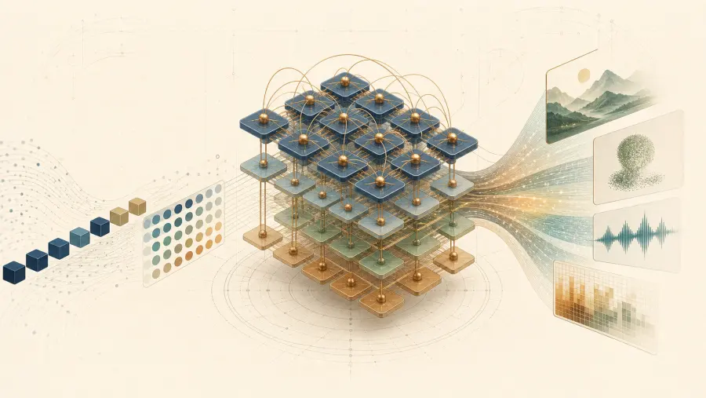
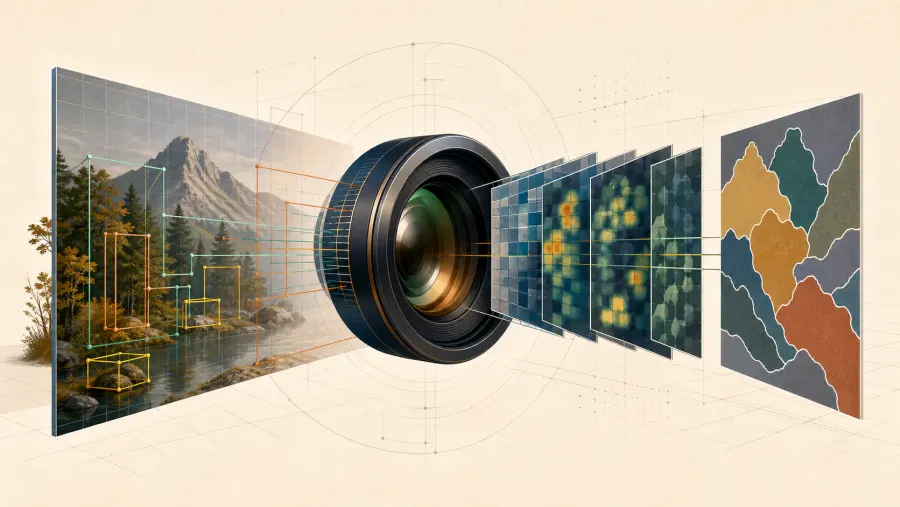
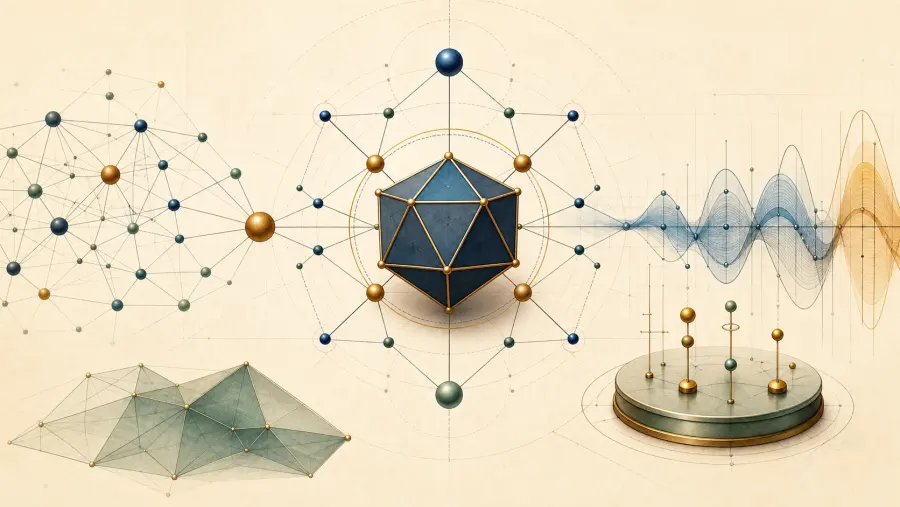
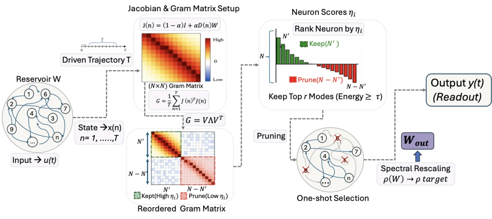
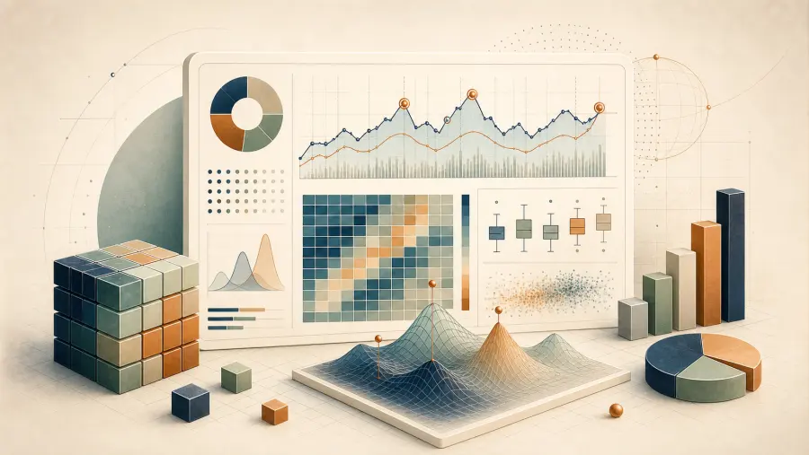
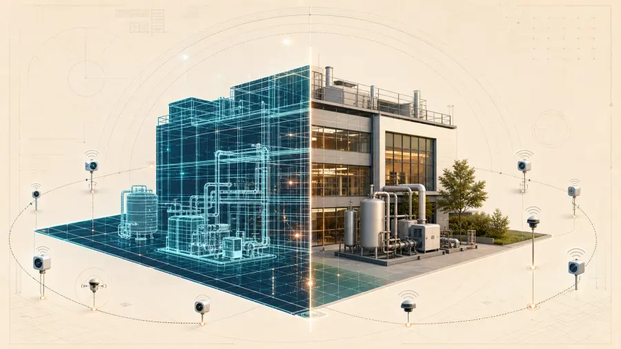

  

<h1 align="center">Sudip Laudari</h1>

<i>Applied Mathematician / Data Scientist / AI & ML Researcher</i>

  Applied mathematics and AI/ML researcher working across computational modelling,
  computer vision, geospatial systems, time-series modelling, and intelligent infrastructure.

  
  
  

  
  
  
  

---

## Field Notes

I build applied mathematical and AI systems that are meant to survive outside research notebooks.
My work usually sits at the intersection of mathematical modelling, research depth,
product engineering, and deployable infrastructure.

Current areas of focus:

- Applied mathematics, computational modelling, and numerical algorithms
- Generative AI, RAG systems, and agent workflows
- Computer vision, OCR, and multimodal applications
- Time-series modelling and anomaly detection
- GIS, remote sensing, and geospatial systems
- ML pipelines, backend services, and production deployment

---

## Working Desk

**Mathematical Foundations**

**AI and Applied Modelling**

**Frameworks and Infrastructure**

**Data, Backend, and Spatial Systems**

---

## Featured Portfolio

Eight focused repositories organize my public work across local AI tooling,
generative AI, agents, computer vision, research, reservoir computing, data
science, and digital twins.

<table>
  <tr>
    <td width="25%" valign="top">
      
       <strong>Vectra</strong> 
      Privacy-focused local AI coding, agent tools, and model discovery.
    </td>
    <td width="25%" valign="top">
      
       <strong>Generative AI</strong> 
      LLMs, transformers, RAG, multimodal systems, and fine-tuning.
    </td>
    <td width="25%" valign="top">
      
       <strong>Agent Collection</strong> 
      Job, task, automation, and tool-using agent workflows.
    </td>
    <td width="25%" valign="top">
      
       <strong>Computer Vision &amp; ML</strong> 
      Detection, OCR, annotation, vision transformers, deployment, and MLOps.
    </td>
  </tr>
  <tr>
    <td width="25%" valign="top">
      
       <strong>Research</strong> 
      Centrality, augmentation, graph learning, PINNs, and reproducible experiments.
    </td>
    <td width="25%" valign="top">
      
       <strong>DMP &amp; ESN</strong> 
      Dynamical learning, reservoir pruning, forecasting, and adaptive control.
    </td>
    <td width="25%" valign="top">
      
       <strong>Data Science</strong> 
      Statistics, forecasting, anomaly detection, and practical analytics.
    </td>
    <td width="25%" valign="top">
      
       <strong>Digital Twin</strong> 
      Physical-system simulation, reconstruction, 3D, and spatial intelligence.
    </td>
  </tr>
</table>

  

---

## Practice Bench

  
  
  

  Maintaining algorithmic fundamentals through regular problem solving and systems thinking.

---

## Correspondence

I am open to research collaboration in applied mathematics, computational modelling, AI/ML, computer vision, geospatial systems, and engineering applications.

If your work connects mathematical methods with real-world systems, feel free to reach out.

<!-- 

  <a href="https://laudarisd.github.io/" target="_blank">Portfolio</a> ·
  
  ·
  

 -->
